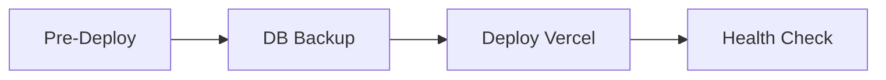

# 🚀 CI/CD Pipeline - Documentación Completa

> **Última actualización:** 2025-01-15  
> **Versión:** 2.0 - Incluye Docker y Plan B

## 📋 Índice Rápido
- [Workflows Automatizados](#workflows-automatizados)
- [Scripts Disponibles](#scripts-disponibles)
- [Secrets Requeridos](#secrets-requeridos)
- [Deploy Options](#opciones-de-deploy)
- [Troubleshooting](#troubleshooting)

---

## 🎯 Overview

Sistema completo de CI/CD con:
- ✅ **CI**: Lint, TypeScript, Build, Security
- 🚀 **CD**: Deploy automático a Vercel
- 🐳 **Docker**: Plan B para VPS (Railway, Fly.io, DigitalOcean)
- 🔒 **Security**: CodeQL, TruffleHog, Dependency scanning
- 🔦 **Performance**: Lighthouse audits
- 📦 **Dependabot**: Actualizaciones automáticas

---

## 🤖 Workflows Automatizados

### 1. CI Pipeline (`ci-pipeline.yml`)
**Trigger:** Push/PR a `main` o `develop`  
**Duración:** ~10-15 min

| Job | Descripción | Tiempo |
|-----|-------------|--------|
| Lint & TypeCheck | ESLint + TypeScript | ~3 min |
| Build | Next.js build + cache | ~5 min |
| Security | npm audit + TruffleHog | ~3 min |
| Database | Prisma validation | ~2 min |

### 2. CD Deploy (`cd-deploy.yml`)
**Trigger:** Push a `main` o manual  
**Duración:** ~15-20 min



| Job | Descripción |
|-----|-------------|
| Pre-Deploy | Validaciones completas |
| Backup | Backup automático de DB |
| Deploy | Deploy a Vercel |
| Health Check | Verificación post-deploy |

### 3. Lighthouse (`lighthouse.yml`)
**Trigger:** PR a `main` o manual  
**Métricas:** Performance, Accessibility, SEO, Best Practices

### 4. Security Scan (`security-scan.yml`)
**Trigger:** Push, PR, Schedule (Lunes 9 AM), Manual  
**Scans:** Dependencies, CodeQL, Secrets, Licenses

### 5. PR Checks (`pr-checks.yml`)
**Trigger:** Pull Requests  
**Validaciones:** Title format, Changes analysis, Bundle size

---

## 🛠️ Scripts Disponibles

### Development
```bash
pnpm dev              # Desarrollo con Turbopack
pnpm dev:normal       # Desarrollo sin Turbopack
```

### Quality Checks
```bash
pnpm lint             # ESLint
pnpm lint:fix         # ESLint con auto-fix
pnpm type-check       # TypeScript check
pnpm validate         # Lint + Type check (recomendado antes de commit)
pnpm format           # Prettier format
pnpm format:check     # Prettier check
```

### Build & Deploy
```bash
pnpm build            # Build de producción
pnpm build:clean      # Limpia .next y hace build
pnpm start            # Servidor de producción
```

### Pre-Deploy Validation
```bash
pnpm pre-deploy       # ✅ Validaciones completas:
                      # - Variables de entorno
                      # - TypeScript check
                      # - Linting
                      # - DB connection
                      # - Prisma schema
                      # - Build test
```

### Database
```bash
pnpm db:backup        # Backup de DB (con timestamp + gzip)
pnpm db:push          # Push schema sin migración
pnpm db:migrate       # Crear migración
pnpm db:migrate:deploy # Deploy migraciones (producción)
pnpm db:studio        # Prisma Studio
```

### Docker (Plan B)
```bash
pnpm docker:build           # Build imagen Docker
pnpm docker:run             # Ejecutar contenedor
pnpm docker:compose:up      # Stack completo (app + DB + Redis)
pnpm docker:compose:down    # Detener stack
pnpm docker:compose:logs    # Ver logs
pnpm docker:deploy          # Deploy a VPS
```

---

## 🔐 Secrets Requeridos

Configurar en: **GitHub Settings > Secrets and variables > Actions**

### Esenciales (Mínimo para CI/CD)
```bash
DATABASE_URL              # PostgreSQL connection (pooler)
DIRECT_DATABASE_URL       # PostgreSQL direct connection
AUTH_SECRET               # NextAuth secret
NEXT_PUBLIC_APP_URL       # URL de la app
NEXT_PUBLIC_BASE_URL      # Base URL
```

### Vercel (Para CD automático)
```bash
VERCEL_TOKEN              # Token de Vercel
VERCEL_ORG_ID             # Organization ID
VERCEL_PROJECT_ID         # Project ID
```

### Servicios Externos
```bash
# Auth
AUTH_GOOGLE_ID
AUTH_GOOGLE_SECRET

# Stripe
STRIPE_API_KEY
STRIPE_WEBHOOK_SECRET

# AI & Media
GEMINI_API_KEY
NEXT_PUBLIC_TENOR_API_KEY
NEXT_PUBLIC_UPLOADCARE_PUBLIC_KEY

# Pusher
PUSHER_APP_ID
PUSHER_KEY
PUSHER_SECRET
PUSHER_CLUSTER
NEXT_PUBLIC_PUSHER_KEY
NEXT_PUBLIC_PUSHER_CLUSTER
```

### VPS (Solo si usas docker:deploy)
```bash
VPS_HOST                  # IP del VPS
VPS_USER                  # Usuario SSH
VPS_SSH_KEY               # Private SSH key
```

---

## 🚀 Opciones de Deploy

### Opción A: Vercel (Actual - Recomendado para MVP)
**Setup:** ✅ Ya configurado  
**Costo:** $0-20/mes  
**Deploy:** Automático con push a `main`

```bash
# Deploy automático
git push origin main

# Ver status
# GitHub Actions > cd-deploy.yml
```

### Opción B: Railway (Plan B - Fácil)
**Setup:** 10 minutos  
**Costo:** $5-10/mes  
**Migración:** Ver `MIGRATION_GUIDE.md`

```bash
npm i -g @railway/cli
railway login
railway init
railway up
```

### Opción C: Fly.io (Plan B - Global)
**Setup:** 15 minutos  
**Costo:** $5-15/mes

```bash
curl -L https://fly.io/install.sh | sh
fly launch
fly deploy
```

### Opción D: DigitalOcean (Plan B - Control Total)
**Setup:** 1-2 horas  
**Costo:** $12/mes  
**Migración:** Ver `MIGRATION_GUIDE.md`

```bash
# Configurar VPS
export VPS_HOST=your-ip
export VPS_USER=root

# Deploy
pnpm docker:deploy
```

**📚 Documentación detallada:**
- `MIGRATION_GUIDE.md` - Guía completa de migración
- `DEPLOYMENT_OPTIONS.md` - Comparación de plataformas

---

## 🔄 Workflow de Desarrollo

### 1. Feature Development
```bash
# Crear rama
git checkout -b feat/nueva-funcionalidad

# Desarrollo
pnpm dev

# Validar antes de commit
pnpm validate

# Commit (conventional commits)
git commit -m "feat: agregar nueva funcionalidad"

# Push
git push origin feat/nueva-funcionalidad
```

### 2. Pull Request
✅ Se ejecutan automáticamente:
- `pr-checks.yml` - Validaciones de PR
- `ci-pipeline.yml` - CI completo
- `lighthouse.yml` - Performance audit (solo PRs a main)

### 3. Merge to Main
✅ Se ejecuta automáticamente:
- `cd-deploy.yml` - Deploy a producción
- Backup de DB
- Health checks post-deploy

---

## 📦 Dependabot

**Configuración:** `.github/dependabot.yml`

- 📦 Dependencias npm: Lunes 9 AM
- 🔧 GitHub Actions: Lunes 9 AM
- Agrupa actualizaciones menores/patches
- Ignora actualizaciones mayores de React/Next.js

---

## 🚨 Troubleshooting

### Build Fails
```bash
# 1. Verificar localmente
pnpm validate
pnpm build

# 2. Revisar secrets en GitHub
# Settings > Secrets and variables > Actions

# 3. Ver logs
# GitHub Actions > Workflow > Job logs
```

### Deploy Fails
```bash
# 1. Verificar conexión a DB
pnpm db:push

# 2. Verificar migraciones
npx prisma migrate status

# 3. Verificar variables en Vercel
# Vercel Dashboard > Settings > Environment Variables
```

### TypeScript Errors
```bash
# Check local
pnpm type-check

# Ver errores específicos
npx tsc --noEmit

# Fix común: regenerar Prisma client
npx prisma generate
```

### Docker Issues
```bash
# Rebuild sin cache
docker build --no-cache -t socialx .

# Ver logs
docker logs socialx-app

# Limpiar todo
docker system prune -a
```

---

## 📊 Monitoreo

### GitHub Actions
- **Workflows:** `.github/workflows/`
- **Ejecuciones:** GitHub > Actions tab
- **Summaries:** Cada workflow genera un summary detallado

### Vercel
- **Dashboard:** https://vercel.com/dashboard
- **Logs:** Vercel > Project > Deployments > Logs
- **Analytics:** Vercel > Project > Analytics

### Health Check
```bash
# Endpoint disponible
curl https://tu-dominio.com/api/health

# Respuesta esperada
{
  "status": "healthy",
  "timestamp": "2025-01-15T...",
  "uptime": 12345,
  "database": "connected",
  "environment": "production"
}
```

---

## 📚 Archivos de Configuración

```
.github/
├── workflows/
│   ├── ci-pipeline.yml       # CI principal
│   ├── cd-deploy.yml         # Deploy automático
│   ├── lighthouse.yml        # Performance audits
│   ├── security-scan.yml     # Security scanning
│   └── pr-checks.yml         # PR validations
├── dependabot.yml            # Dependency updates
└── CODEOWNERS                # Code reviewers

scripts/
├── pre-deploy.sh             # Pre-deploy validation
├── db-backup.sh              # Database backup
├── docker-build.sh           # Docker build
└── docker-deploy.sh          # VPS deployment

# Docker
Dockerfile                    # Multi-stage optimizado
docker-compose.yml            # Stack completo
.dockerignore                 # Build optimization

# Config
vercel.json                   # Vercel configuration
.npmrc                        # pnpm configuration
.prettierrc                   # Code formatting
next.config.ts                # Next.js config (output: standalone)
```

---

## 🎯 Best Practices

1. **Commits:** Usar conventional commits (`feat:`, `fix:`, `chore:`)
2. **PRs:** Incluir descripción detallada y screenshots
3. **Tests:** Agregar tests antes de merge (cuando estén disponibles)
4. **Secrets:** NUNCA commitear secrets en el código
5. **Dependencies:** Mantener actualizadas (Dependabot ayuda)
6. **Migrations:** Probar localmente antes de deploy
7. **Validación:** Ejecutar `pnpm validate` antes de cada commit
8. **Backup:** Ejecutar `pnpm db:backup` antes de cambios grandes

---

## 🔗 Links Útiles

- [GitHub Actions Docs](https://docs.github.com/en/actions)
- [Vercel Docs](https://vercel.com/docs)
- [Prisma Docs](https://www.prisma.io/docs)
- [Next.js Docs](https://nextjs.org/docs)
- [Docker Docs](https://docs.docker.com)

---

## 📖 Documentación Adicional

- **MIGRATION_GUIDE.md** - Guía completa de migración Vercel → VPS
- **DEPLOYMENT_OPTIONS.md** - Comparación detallada de plataformas
- **SCRIPTS_OVERVIEW.md** - Referencia completa de scripts
- **SOLUCIONES_BUILD.md** - Soluciones a problemas comunes de build

---

**Mantenido por:** Leonardo  
**Última actualización:** 2025-01-15  
**Versión:** 2.0
